## Checklist to prepare for SAT setup

**Note**: SAT creates a new **security_analysis** databses and Delta tables. 

If you are an existing SAT user please run the following command to reset your Database in your DBSQL SQL Editor. 

for Hive metastore based SAT schema:
  ``` 
    drop  database security_analysis cascade
   ```
  or for Unity Catalog based SAT schema:
   ``` 
    drop  database <uc catalog name>.security_analysis cascade
   ```  
Please make sure you are using char - in all secret key names as opposed to char _ .   

**Note**: SAT can be setup as Terraform based deployment, if you use Terrafrom in your organization please please prefer Terrafrom instructions: 
* [SAT AWS Terraform deployment](https://github.com/databricks-industry-solutions/security-analysis-tool/blob/main/terraform/aws/TERRAFORM_AWS.md) 
* [SAT Azure Terraform deployment](https://github.com/databricks-industry-solutions/security-analysis-tool/blob/main/terraform/azure/TERRAFORM_Azure.md) 
* [SAT GCP Terraform deployment](https://github.com/databricks-industry-solutions/security-analysis-tool/blob/main/terraform/gcp/TERRAFORM_GCP.md) 

**Note**: SAT is a productivity tool to help verify security configurations of Databricks deployments, it's not meant to be used as certification or attestation of your deployments. SAT project is regularly updated to improve the correctness of checks, add new checks, and fix bugs. Please send your feedback and comments to sat@databricks.com.


You will need the following information to set up SAT, we will show you how to gather them in the next section.

We created a companion Security Analysis Tool (SAT) [Setup primer video for AWS](https://www.youtube.com/watch?v=kLSc3UHKL40), Step by step follow along instructions [video for Azure Databricks](https://youtu.be/xAav6GslSd8) and a [Deployment checklist sheet](./) to help prepare for the SAT setup. 

Note: SAT is beneficial to customers on [Databrics Premium or higher](https://www.databricks.com/product/pricing/platform-addons) as most of the checks and recommendations involve security features available in tiers higher than the Standard. 

 1. Databricks Account ID 
 2. A Single user cluster  (To run the SAT checks)
 3. Databricks SQL Warehouse  (To run the SQL dashboard)
 4. Ensure that Databricks Repos is enabled (To access the SAT git) and [Files in Repo](https://docs.databricks.com/files/workspace.html#configure-support-for-workspace-files) set to DBR 8.4+ or DBR 11.0+ (To allow arbitrary files  in Repo operations)
 5. Pypi access from your workspace (To install the SAT utility library)
 6. Create secrets scopes (To store configuration values)
 7. Authentication information:
    * **AWS:** Administrative user id and password or Service Principal Client ID and Secret, to call the account REST APIs
    * **Azure:** Azure subscriptionId,  The Directory Tenant ID, The Application Client ID  and The Client secret generated by AAD   (To call the account REST APIs)
    * **GCP:** Service account key and impersonate-service-account  (To call the account REST APIs and read service account key file from GCS)
 8. Setup configuration in secrets and access configuration via secrets
 9. (Optional but recommended) A [Unity Catalog catalog name](https://docs.databricks.com/en/data-governance/unity-catalog/index.html#catalogs) to store SAT database, by default SAT uses Hive metastore to store SAT analysis as tables. You can use the Unity catalog instead of using Hive metastore. Make sure the clusters have the necessary [permissions](https://docs.databricks.com/en/data-governance/unity-catalog/manage-privileges/privileges.html) when using the Unity Catalog.  The CREATE SCHEMA and USE CATALOG are required so that SAT can create the Schema in the catalog.
  
## Prerequisites 

 (Estimated time to complete these steps: 15 - 30 mins)


Please gather the following information before you start setting up: 
 
 1. Databricks Account ID 
     * Please test your administrator account and password to make sure this is a working account: <br/>
       **AWS:** [https://accounts.cloud.databricks.com](https://accounts.cloud.databricks.com) <br/>
       **Azure:** [https://accounts.azuredatabricks.net](https://accounts.azuredatabricks.net) <br/>
       **GCP:** [https://accounts.gcp.databricks.com](https://accounts.gcp.databricks.com)<br/>
       
     * Copy the account id as shown below

        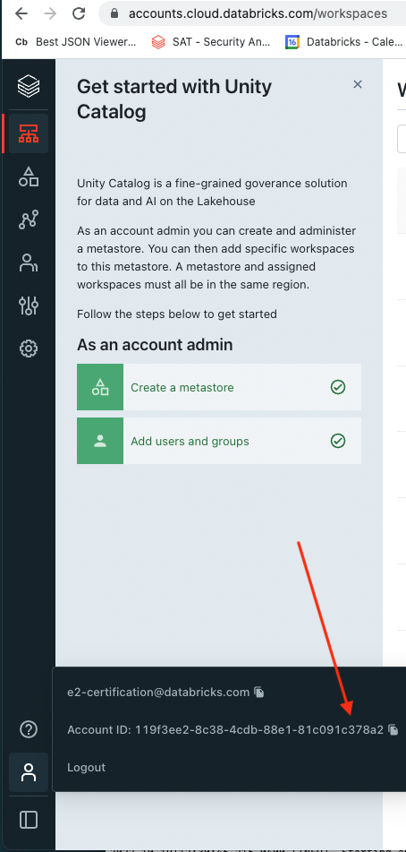

 2. A Single user cluster  
    *  Databricks Runtime Version  14.3 LTS
    *  Node type i3.xlarge (please start with a max of a two node cluster and adjust to 5 nodes if you have many workspaces that will be analyzed with SAT)  

        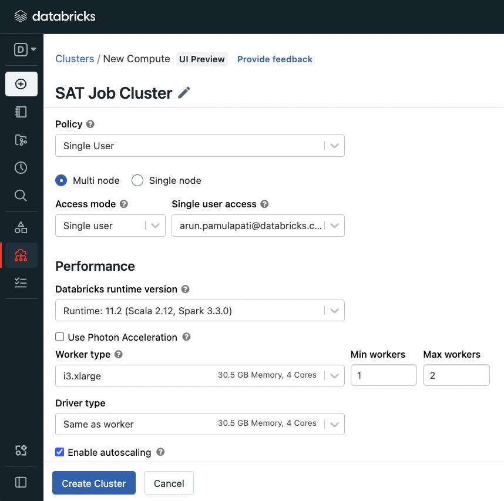
     **Note:**  In our tests we found that the full run of SAT takes about 10 mins per workspace. 
     
 3. Databricks SQL Warehouse  
    * Goto SQL (pane) -> SQL Warehouse -> and pick the SQL Warehouse for your dashboard and note down the ID as shown below
    * This Warehouse needs to be in a running state when you run steps in the Setup section.
    
        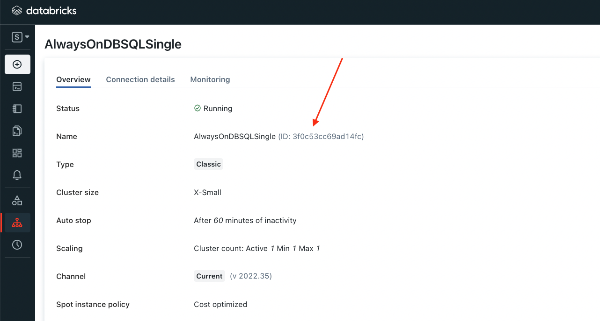

 4. Databricks Repos to access SAT git
    Import git repo into Databricks repo 

    ``` 
           https://github.com/databricks-industry-solutions/security-analysis-tool
    ```


      

5. Please confirm that PyPI access is available

    * Open the \<SATProject\>/notebooks/Includes/install_sat_sdk  and run on the cluster that was created in the Step 2 above. 
    Please make sure there are no errors.
    If your deployment does not allow PyPI access please see the FAQ below at the end of this doc to see alternative options. 

6. Create secrets scopes

  * Download and setup Databricks CLI (version 0.205 and above) by following the instructions [here](https://docs.databricks.com/dev-tools/cli/index.html) on your work laptop or your virtual workstation.   
  * Note: if you have multiple Databricks profiles you will need to use --profile <profile name> switch to access the correct workspace,
    follow the instructions [here](https://docs.databricks.com/dev-tools/cli/index.html#connection-profiles) . Throughout the documentation below we use an example profile **e2-sat**, please adjust your commands as per your workspace profile or exclude  --profile <optional-profile-name> if you are using the default profile. 
  * Setup authentication to your Databricks workspace by following the instructions [here](https://docs.databricks.com/dev-tools/cli/index.html#set-up-authentication)

       ```
            databricks --profile e2-sat configure
       ```

     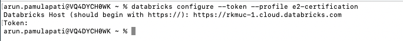

     You should see a listing of folders in your workspace : 
      ```
           databricks --profile e2-sat workspace list /Users
      ```

     


  *  Set up the secret scope with the scope name you prefer and note it down:
     
     Note: The values you place below are case sensitive and need to be exact. 
 
     ```
      databricks --profile e2-sat secrets create-scope sat_scope
      ```

     For more details refer [here](https://docs.databricks.com/dev-tools/cli/secrets-cli.html) 

7.  #### Authentication information:
  
  
      <details>
       <summary>AWS instructions</summary>  

       You can either authenticate with username and password or using Service Principals credentials.
       
       **Authenticate with Username and Password (default)**
       
       Create username secret and password secret of administrative user id and password  as  "user" and "pass" under the above "sat_scope" scope using Databricks Secrets CLI 

       *  Input your Databricks account console admin username to store it in a the secret store
           ```
           databricks --profile e2-sat secrets put-secret sat_scope user
           ```

       *  Input your Databricks account console admin account password to store it in a the secret store

           ```
           databricks --profile e2-sat secrets put-secret sat_scope pass
           ```    
       
       **Authenticate using a Service Principal**

       Create a Service Principal and generate a secret for it. Follow steps 1 to 3 in [this documentation](https://docs.databricks.com/dev-tools/authentication-oauth.html#:~:text=To%20create%20an%20OAuth%20secret%20for%20a%20service,the%20same%20as%20the%20service%20principal%E2%80%99s%20application%20ID)
    Follow the instructions and add a service principal to a workspace using the admin console as detailed in the document for each workspace you would like to analyze as an admin (Note: the Admin role for the Service Principle is required to analyze many of the APIs).
       
       1. Set the use_sp_auth to `true` in order to use the Service Principal Authentication Flow

           ```
           databricks --profile e2-sat secrets put-secret sat_scope use-sp-auth --string-value true
           ```
       
       2. Store your Databricks Service Principal Client ID in the secret store:

           ```
           databricks --profile e2-sat secrets put-secret sat_scope client-id --string-value <client_id>
           ```

       3. Store your Databricks Service Principal Secret in the secret store:

           ```
           databricks --profile e2-sat secrets put-secret sat_scope client-secret  --string-value <client_secret>
           ```
      </details>

      <details>
       <summary>Azure instructions</summary>  

      We will be using the instructions in [Get Azure AD tokens for service principals](https://learn.microsoft.com/en-us/azure/databricks/dev-tools/api/latest/aad/service-prin-aad-token).
       *  Follow the document above and complete all steps in the "Provision a service principal in Azure portal" only as detailed in the document.
       *  On the application page’s Overview page, in the Essentials section, copy the following values: (You will need this in the step below)
          * Application (client) ID as client_id
          * Directory (tenant) ID tenant_id
          * client_secret (The secret generated by AAD during your confidential app registration)  client_credential
          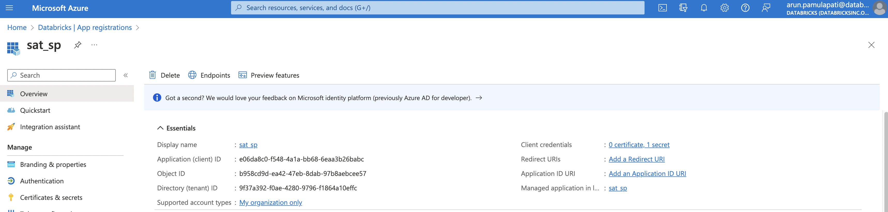
       *  Notedown the "Display name" as Service Principle name. (You will need this in the step below)
       *  Notedown the Subscription ID as subscription_id from the Subscriptions section of the Azure portal
       *  Please add the service principle with "Reader" role into the subscription level via Access control (IAM) using Role assignments under your [subscription, Access control (IAM) section](https://learn.microsoft.com/en-us/azure/role-based-access-control/role-assignments-portal#step-2-open-the-add-role-assignment-page) 

           
      </details> 

      <details>
       <summary>GCP instructions</summary>  

      We will be using the instructions in [Authenticate to workspace or account APIs with a Google ID token](https://docs.gcp.databricks.com/dev-tools/api/latest/authentication-google-id.html).
        
      *  Follow the document above and complete all steps in the [Step 1](https://docs.gcp.databricks.com/dev-tools/api/latest/authentication-google-id.html#step-1-create-two-service-accounts) as detailed in the document.
      *  Notedown the name and location of service account key json file. (You will need this in the steps below)
      *  Notedown the impersonate-service-account email address. (You will need this in the step below)
      *  Upload the service account key json file to your [GCS bucket](https://docs.gcp.databricks.com/storage/gcs.html) from the [Authentication information](#authentication-information) above. Make sure to use the impersonate-service-account email address that you used above for the service account on the bucket, copy the "gsutil URI" ("File path to this resource in Cloud Storage") path.  (You will need this in the steps below)

          

      </details>  

9. Setup configuration in secrets and access configuration via secrets
    * Create a secret for the workspace PAT token

      **Note**: Replace \<workspace_id\> with your SAT deployment workspace id. 
       You can find your workspace id by following the instructions [here](https://docs.databricks.com/workspace/workspace-details.html)

       You can create a PAT token by following the instructions [here](https://docs.databricks.com/dev-tools/api/latest/authentication.html#generate-a-personal-access-token). Please pay attention to _ and - , scopes use _ and keys must use - .
     * Set the PAT token value for the workspace_id 
     * Set the value for the account_id 
     * Set the value for the sql_warehouse_id
     * Set the value for the analysis_schema_name to store SAT analysis results (for UC use catalog.schema name , for hive use schema name)
    

       ```
       databricks --profile e2-sat secrets put-secret sat_scope sat-token-<workspace_id> 
       ``` 
  
       ```
       databricks --profile e2-sat secrets put-secret sat_scope account-console-id
       ```  
        
       ```
       databricks --profile e2-sat secrets put-secret sat_scope sql-warehouse-id
       ```  
        
       ```
       databricks --profile e2-sat secrets put-secret sat_scope analysis_schema_name 
       ```  
    

   * In your environment where you imported SAT project from git (Refer to Step 4 in Prerequisites) Open the \<SATProject\>/notebooks/Utils/initialize notebook and modify the JSON string with :  
     * Set the value for the account_id 
     * Set the value for the sql_warehouse_id
     * Databricks secrets scope/key names to pick the secrets from the steps above.

     * Your config in  \<SATProject\>/notebooks/Utils/initialize CMD 4 should look like this if you are using the secrets (Required for TF deployments), no need to edit the cell:
         ```
              {
                 "account_id": dbutils.secrets.get(scope="sat_scope", key="account-console-id"),   
                 "sql_warehouse_id": dbutils.secrets.get(scope="sat_scope", key="sql-warehouse-id"),
                 "analysis_schema_name": dbutils.secrets.get(scope="sat_scope", key="analysis_schema_name"),
                 "verbosity":"info"
              }

        ```        
      * Your config in  \<SATProject\>/notebooks/Utils/initialize CMD 4 should look like this if you are NOT using Terraform deployment and the secrets are not configured (backward compatibility). Change the analysis_schema_name value from security_analysis to a different name for SAT database to store its internal tables, change it to "catalog.schamaname" if you want to use Unity Catalog for storing SAT internal tables:
    
        ```
              {
                 "account_id":"aaaaaaaa-bbbb-cccc-dddd-eeeeeeeeeeee",  <- replace with the actual account_id value
                 "sql_warehouse_id":"4d9fef7de2b9995c",     <- replace with the actual sql_warehouse_id value
                 "analysis_schema_name":"security_analysis", <- database for SAT, use "catalog.database" for Unity Catalog or use "database" for Hive metastore.
                 "verbosity":"info"
              }

        ```
     
     *  Azure additional configurations:
          <details>
           <summary>Azure instructions</summary>  
  
          * Setup the Subscription ID in a secret as subscription-id
  
             ```
               databricks --profile e2-sat secrets put-secret sat_scope subscription-id
             ``` 
  
          * Set the Directory (tenant) ID as tenant-id 
  
             ```
               databricks --profile e2-sat secrets put-secret sat_scope tenant-id
             ``` 
  
          * Setup the Application (client) ID as client-id 
    
             ```
               databricks --profile e2-sat secrets put-secret sat_scope client-id
             ``` 
  
          * Setup the Client secret in a secret 
             ```
               databricks --profile e2-sat secrets put-secret sat_scope client-secret
             ``` 
      
         * Your config in  \<SATProject\>/notebooks/Utils/initialize CMD 7 should look like this if you are using the secrets (Required for TF deployments), no need to edit the cell:

             ```
                  if cloud_type == 'azure':
                      json_.update({
                         "account_id":"azure",
                         "subscription_id": dbutils.secrets.get(scope="sat_scope", key="subscription-id"), # Azure subscriptionId
                         "tenant_id": dbutils.secrets.get(scope="sat_scope", key="tenant-id"), #The Directory (tenant) ID for the application registered in Azure AD.
                         "client_id": dbutils.secrets.get(scope="sat_scope", key="client-id"), # The Application (client) ID for the application registered in Azure AD.
                         "client_secret_key":"client-secret",  #The secret generated by AAD during your confidential app registration
                         "use_mastercreds":True
                      })

             ``` 
  
          * Your config in  \<SATProject\>/notebooks/Utils/initialize CMD 7 should look like this if you are NOT using Terrafrom deployment and the secrets are not configured (backward compatibility):

             ```
                   json_.update({
                      "account_id":"azure",
                      "subscription_id":"xxxxxxxx-fake-46d6-82bd-5cc8d962326b", # Azure subscriptionId
                      "tenant_id":"xxxxxxxx-fake-4280-9796-b1864a10effd", #The Directory (tenant) ID for the application registered in Azure AD.
                      "client_id":"xxxxxxxx-fake-4q1a-bb68-6ear3b26btbd", # The Application (client) ID for the application registered in Azure AD.
                      "client_secret_key":"client-secret",  #The secret generated by AAD during your confidential app registration
                      "use_mastercreds":True
                  })

             ``` 
           *  Follow the instructions "Add a service principal to a workspace" [Add a service principal to a workspace using the admin console](https://learn.microsoft.com/en-us/azure/databricks/administration-guide/users-groups/service-principals#--add-a-service-principal-to-a-workspace) as detailed in the document for each workspace you would like to analyze as an admin (Note: the Admin role for the Service Principle is required to analyze many of the APIs).

           

          </details>                                                              
                                                              
     *  GCP additional configurations:
          <details>
           <summary>GCP instructions</summary>  
 
          
            
          * Setup the service account key json file in a secret as gs-path-to-json with the the "gsutil URI" ("File path to this resource in Cloud Storage") path :  
  
             ```
               databricks --profile e2-sat secrets put-secret sat_scope gs-path-to-json
             ``` 
          * Setup the impersonate-service-account email address in a secret as impersonate-service-account
  
             ```
               databricks --profile e2-sat secrets put-secret sat_scope impersonate-service-account
             ``` 
        
          * Your config in  \<SATProject\>/notebooks/Utils/initialize CMD 6 should look like this if you are using the secrets (Required for TF deployments), no need to edit the cell:
            

             ```
                   #GCP configurations 
                     json_.update({
                         "service_account_key_file_path": dbutils.secrets.get(scope="sat_scope_arun", key="gs-path-to-json"),
                         "impersonate_service_account": dbutils.secrets.get(scope="sat_scope_arun", key="impersonate-service-account"),
                         "use_mastercreds":False
                      })

             ``` 
         * Your config in  \<SATProject\>/notebooks/Utils/initialize CMD 7 should look like this if you are NOT using Terrafrom deployment and the secrets are not configured (backward compatibility):        
            ```
                   #GCP configurations 
                      json_.update({
                         "service_account_key_file_path":"gs://sat_dev/key/SA-1-key.json",    <- update this value
                         "impersonate_service_account":"xyz-sa-2@project.iam.gserviceaccount.com",  <- update this value
                         "use_mastercreds":False <- don't update this value                                  
                      })
             ```                            
                           
          *  Follow the instructions in Step 4 of [Authenticate to workspace or account APIs with a Google ID token]([https://docs.gcp.databricks.com/dev-tools/api/latest/authentication-google-id-account-private-preview.html#step-1-create-two-service-accounts](https://docs.gcp.databricks.com/dev-tools/api/latest/authentication-google-id-account-private-preview.html#step-4-add-the-service-account-as-a-workspace-or-account-user)) as detailed in the document for each workspace you would like to analyze and the account to add your main service account (SA-2) as an admin (Note: the Admin role for the Service account is required to analyze many of the APIs).

           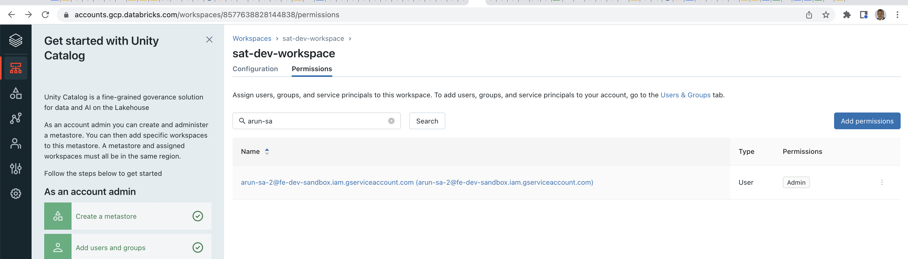

           
                           
          *  Make sure the cluster you configured to run the analysis has ability to read the "service account key json file" by adding the Google service account under the "Advanced Options" of the cluster to the "Google Service Account" value you noted.       
                           
           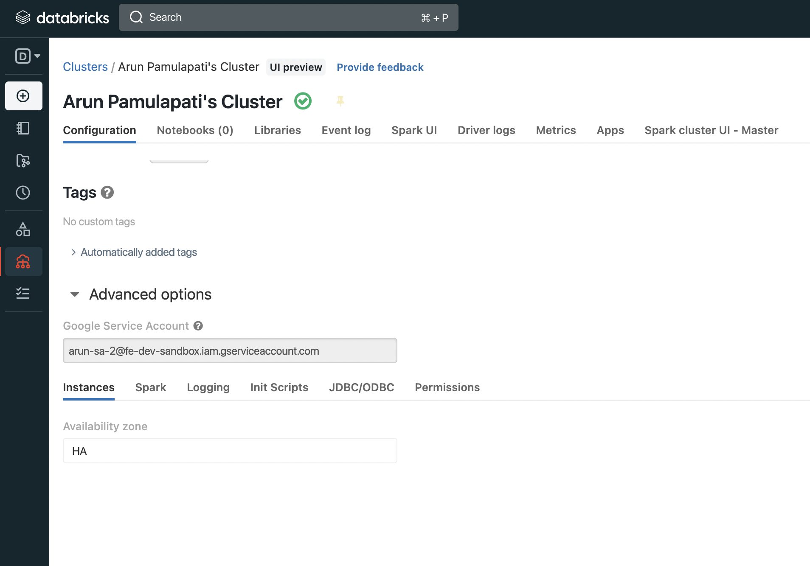   
                           
          </details>
                           
          
           
## Setup option 1 (Simple and recommended method)
                                                           
  (Estimated time to complete these steps: 15 - 30 mins, varies by number of workspaces in the account)  
 This method uses admin/service principle credentials (configured in the Step 6 of Prerequisites section) to call workspace APIs.   
                                                           
 Make sure both SAT job cluster (Refer to Prerequisites Step 2 ) and Warehouse (Refer to Prerequisites Step 3) are running.                                                                    
<details>
  <summary>Setup instructions</summary>                                                                          
 Following is the one time easy setup to get your workspaces setup with the SAT:

* Attach  \<SATProject\>/notebooks/security_analysis_initializer to the SAT cluster you created above and Run -> Run all 
 
    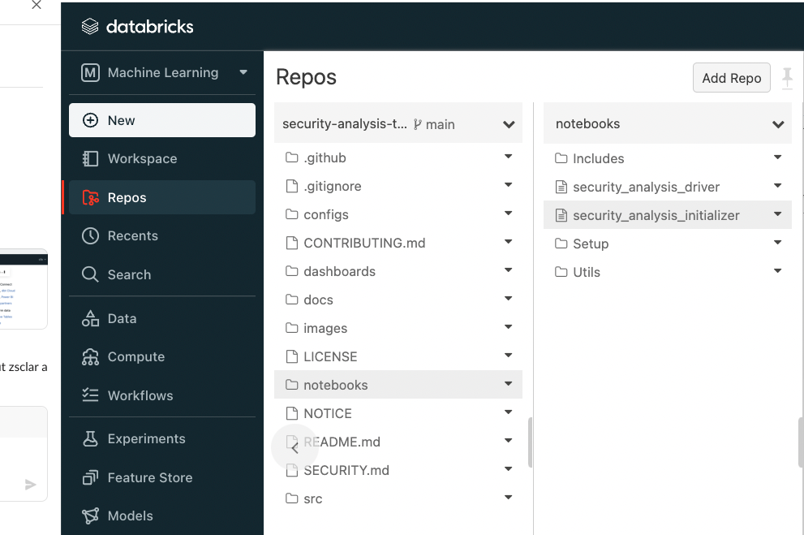
 
 
    
    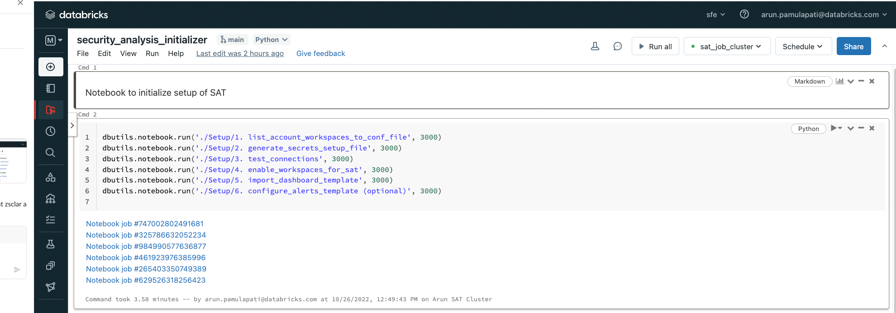
   
</details>
 
## Setup option 2 (Most flexible for the power users)
 
  (Estimated time to complete these steps: 30 mins)  
   This method uses admin credentials (configured in the Step 6 of Prerequisites section) by default to call workspace APIs. But can be changed to use workspace PAT tokens instead.
<details>
  <summary>Setup instructions</summary> 
 Following are the one time easy steps to get your workspaces setup with the SAT:
                  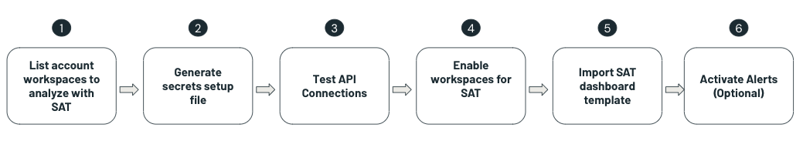  
 
1. List account workspaces to analyze with SAT
   * Goto  \<SATProject\>/notebooks/Setup/1.list_account_workspaces_to_conf_file and Run -> Run all 
   * This creates a configuration file as noted at the bottom of the notebook.

    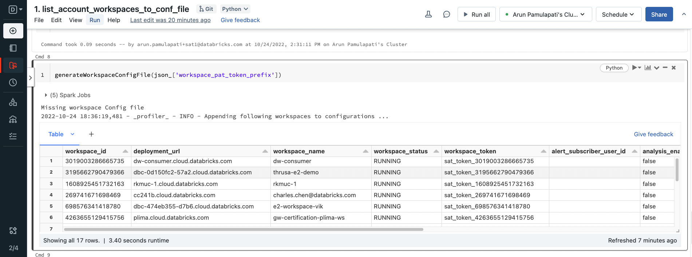
   
   
2. Generate secrets setup file (AWS only. Not recommended for Azure and GCP)
   Deprecated as AWS Service principles are encouraged inplace of workspace PATs. 
   
   
3. Test API Connections    
   * Test connections from your workspace to accounts API calls and all workspace API calls by running \<SATProject\>/notebooks/Setup/3. test_connections. The workspaces that didn't pass the connection test are marked in workspace_configs.csv with connection_test as False and are not analyzed.

    
   
4. Enable workspaces for SAT analysis
   * Enable workspaces by running \<SATProject\>/notebooks/Setup/4. enable_workspaces_for_sat.  This makes the registered workspaces ready for SAT to monitor 

    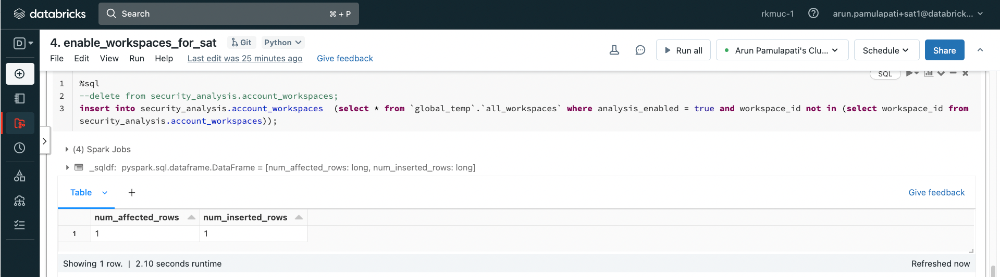
   
5. Import SAT dashboard template
   * We built a ready to go DBSQL dashboard for SAT. Import the dashboard by running \<SATProject\>/notebooks/Setup/5. import_dashboard_template

       
   
6. Configure Alerts 
   SAT can deliver alerts via email via Databricks SQL Alerts. Import the alerts template by running \<SATProject\>/notebooks/Setup/6. configure_alerts_template (optional)

   
   
</details>
   
## Update  configuration files
            
1. Modify security_best_practices (Optional) 
   * Go to \<SATProject\>/notebooks/Setup/7. update_sat_check_configuration and use this utility to enable/disable a Check, modify Evaluation Value and Alert configuration value for each check. You can update this file any time and any analysis from there on will take these values into consideration. 
   * [Configure widget settings](https://docs.databricks.com/notebooks/widgets.html#configure-widget-settings-1) behavior "On Widget Change" for this notebooks to "Do Nothing"         
            
    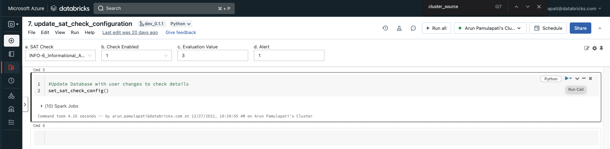
 
2. Modify workspace_configs file (Required for manual checks values)
     * **Note**:  Limit number of workspaces to be analyzed by SAT to 100. 
     * **Tip**:  You can use this utility to turn on a specific workspace and turn off other workspaces for a specific run.
     * **Tip**:  You can use this utility to apply your edits to multiple workspaces settings by using "Apply Setting to all workspaces" option.
     
     * Go to\<SATProject\>/notebooks/Setup/8. update_workspace_configuration and  You will need to set analysis_enabled as True or False based on if you would like to enroll a workspace to analyze by the SAT.
      * [Configure widget settings](https://docs.databricks.com/notebooks/widgets.html#configure-widget-settings-1) behavior "On Widget Change" for this notebooks to "Do Nothing"   
     
     
     Update values for each workspace for the manual checks:(    sso_enabled,scim_enabled,vpc_peering_done,object_storage_encypted,table_access_control_enabled)
 
     * sso_enabled : True if you enabled Single Singn-on for the workspace
     * scim_enabled: True if you integrated with  SCIM for the workspace
     * vpc_peering_done: False if you have not peered with another VPC 
     * object_storage_encypted: True if you encrypted your data buckets
     * table_access_control_enabled : True if you enabled ACLs so that you can utilize Table ACL clusters that enforce user isolation  
     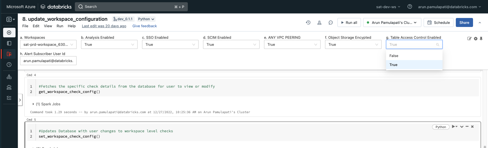  
 
## Usage
 
 (Estimated time to complete these steps: 5 - 10 mins per workspace)  
 **Note**:  Limit number of workspaces to be analyzed by SAT to 100. 
1. Attach and run the notebook \<SATProject\>/notebooks/security_analysis_driver 
   Note: This process takes upto 10 mins per workspace
 
   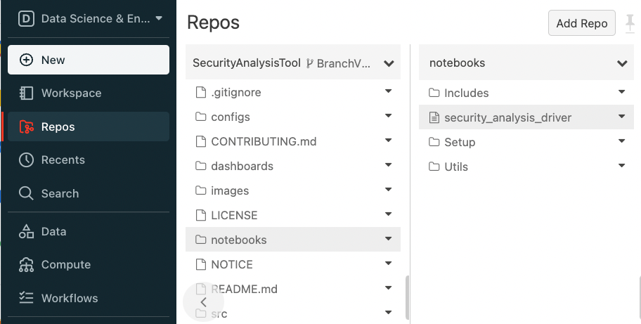
   
 
   At this point you should see **SAT** database and tables in your SQL Warehouses:

   
   
   
   
2. Access Databricks SQL Dashboards section and find "SAT - Security Analysis Tool" dashboard  to see the report. You can filter the dashboard by **SAT** tag. 
   
   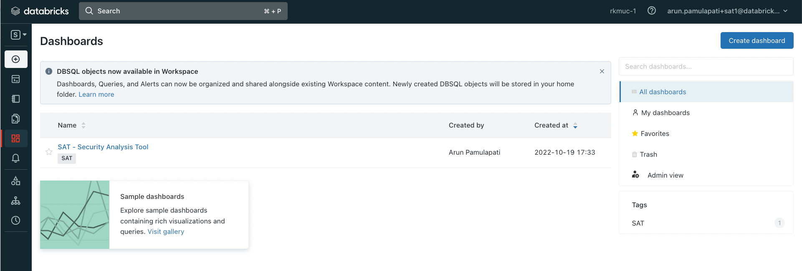

    **Note:** You need to select the workspace and date and click "Apply Changes" to get the report.  
    **Note:** The dashbord shows last valid run for the selected date if there is one, if not it shows the latest report for that workspace.  
 
    You can share SAT dashboard with other members of your team by using the "Share" functionality on the top right corner of the dashboard. 
      
     
    Here is what your SAT Dashboard should look like:
 
      
    
3.  Activate Alerts 
  * Goto Alerts and find the alert(s) created by SAT tag and adjust the schedule to your needs. You can add more recpients to alerts by configuring  [notification destinations](https://docs.databricks.com/sql/admin/notification-destinations.html).
     

      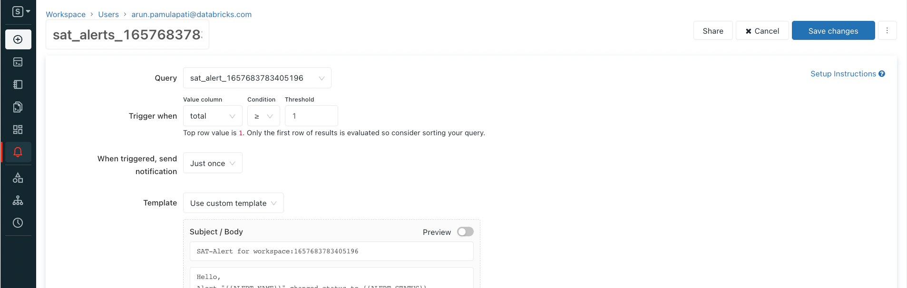   
 

         

   
   
## Configure Workflow (Optional) 
 
 (Estimated time to complete these steps: 5 mins)  
 
  * Databricks Workflows is the fully-managed orchestration service. You can configure SAT to automate when and how you would like to schedule it by using by taking advantage of Workflows. 

  * Goto Workflows - > click on create jobs -> setup as following:

    Task Name  : security_analysis_driver

    Type: Notebook

    Source: Workspace (or your git clone of SAT)

    Path : \<SATProject\>/SAT/SecurityAnalysisTool-BranchV2Root/notebooks/security_analysis_driver

    Cluster: Make sure to pick the Single user mode job compute cluster you created before. 

    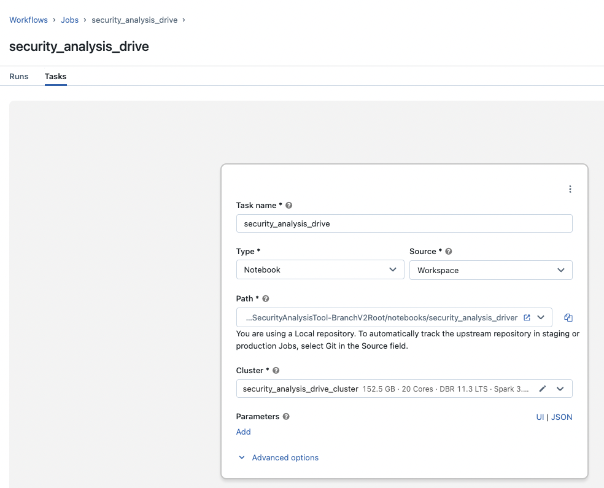   

    Add a schedule as per your needs. That’s it. Now you are continuously monitoring the health of your account workspaces.


## FAQs
 1. How can SAT be configured if access to github is not possible due to firewall restrictions to git or other organization policies?
    
    You can still setup SAT by downloading the [release zip](https://github.com/databricks-industry-solutions/security-analysis-tool/releases) file and by using Git repo to load SAT project into your workspace.
     * Add Repo by going to Repos in your workspace:  
     
      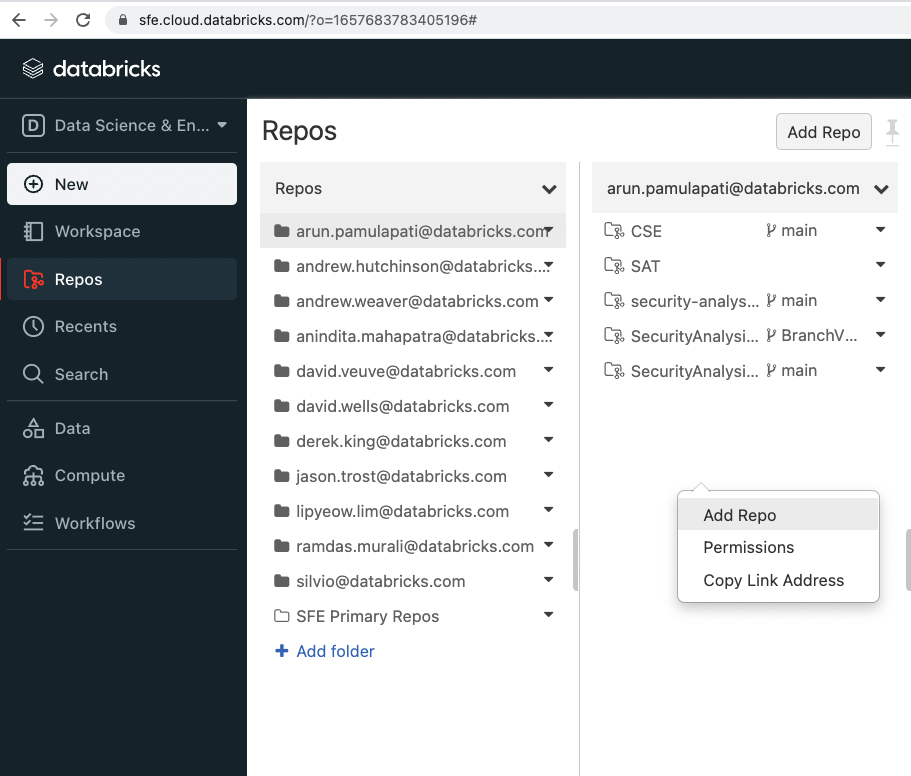   
 
     * Type SAT as your "Repository name" and uncheck "Create repo by cloning a Git repository"
 
      
 
     * Click on the pulldown menu and click on Import
      
      

     * Drag and drop the release zip file and click Import
 
      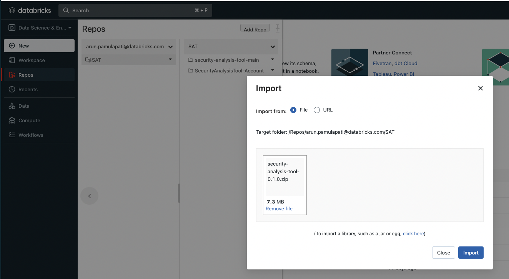
      
      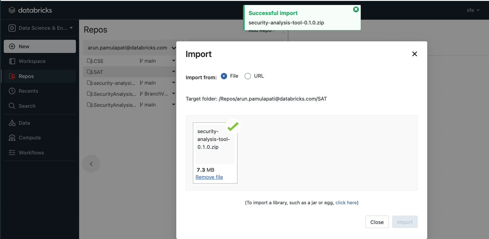 
    
    You should see the SAT project in your workspace. 
2. Can SAT make modifications to my workspaces and account?
     
            
     No. SAT is meant to be a readonly analysis tool, it does not make changes to your workspace or account configurations. 
            
3.  I added a new workspace for analysis, re-ran steps under initilaize and driver, ... the dashboard is not updated with the new workspace in the pulldown even though I see new data generated by the analysis scan for the new workspace in SAT database. What should I do?
          
    It is likely that the Dashboard cached the workspaces in the pulldown. You can go to SQL view of your workspace -> Queries -> find workspace_ids query and run it, that should refresh and have the new workspaces in the pull-down.      
            
            
## Troubleshooting
We created diagnosis notebooks for respective clouds to help troubleshoot your SAT setup. Please review notebooks/diagnosis/ folder.

1. Incorrectly configured secrets
    * Error:
   
      Secret does not exist with scope: sat_scope and key: sat_tokens

    * Resolution:
      Check if the tokens are configured with the correct names by listing and comparing with the configuration.
      databricks --profile e2-sat secrets list-secrets sat_scope

2. Invalid access token
   
    * Error:
   
      Error 403 Invalid access token.

    * Resolution: 
   
      Check your PAT token configuration for  “workspace_pat_token” key 

3. Firewall blocking databricks accounts console

    * Error: 
         <p/>   
         Traceback (most recent call last): File "/databricks/python/lib/python3.8/site-packages/urllib3/connectionpool.py", line 670, in urlopen  httplib_response = self._make_request(  File "/databricks/python/lib/python3.8/site-packages/urllib3/connectionpool.py", line 381, in _make_request  self._validate_conn(conn)  File "/databricks/python/lib/python3.8/site-packages/urllib3/connectionpool.py", line 978, in _validate_conn  conn.connect()  File "/databricks/python/lib/python3.8/site-packages/urllib3/connection.py", line 362, in connect  self.sock = ssl_wrap_socket(  File "/databricks/python/lib/python3.8/site-packages/urllib3/util/ssl_.py", line 386, in ssl_wrap_socket  return context.wrap_socket(sock, server_hostname=server_hostname)  File "/usr/lib/python3.8/ssl.py", line 500, in wrap_socket  return self.sslsocket_class._create(  File "/usr/lib/python3.8/ssl.py", line 1040, in _create  self.do_handshake()  File "/usr/lib/python3.8/ssl.py", line 1309, in do_handshake  self._sslobj.do_handshake() ConnectionResetError: [Errno 104] Connection reset by peer During handling of the above exception, another exception occurred:

    * Resolution: 
   
      Run this following command in your notebook %sh 
      curl -X GET -H "Authorization: Basic /<base64 of userid:password/>" -H "Content-Type: application/json" https://accounts.cloud.databricks.com/api/2.0/accounts/<account_id>/workspaces

      or
            
     %sh curl -u 'user:password' -X GET  “Content-Type: application/json” https://accounts.cloud.databricks.com/api/2.0/accounts/<account_id>/workspaces       
            
      If you don’t see a JSON with a clean listing of workspaces you are likely having a firewall issue that is blocking calls to the accounts console.  Please have your infrastructure team add Databricks accounts.cloud.databricks.com to the allow-list.   Please see that the private IPv4 address from NAT gateway to the IP allow list. 

4. Offline install of libraries incase of no PyPI access 

      Download the dbl_sat_sdk version specified in the notebook notebooks/utils/initialize from PyPi
      https://pypi.org/project/dbl-sat-sdk/
      Upload the dbl_sat_sdk-w.x.y-py3-none-any.whl to a dbfs location. You can use the databricks-cli as one mechanism to upload.
      for e.g.

      ```
      databricks --profile e2-satfs cp /localdrive/whlfile/dbl_sat_sdk-w.x.y-py3-none-any.whl dbfs:/FileStore/wheels/
      ```
      Additionally download the following wheel files and upload them to the dbfs location as above.
      https://github.com/databricks-industry-solutions/security-analysis-tool/tree/main/docs/wheels
            
      Upload all wheel files to /FileStore/wheels in your workspace
      Verify all files are there by doing a %fs ls /FileStore/wheels from your notebook.
      Then change the cell in your notebook  install_sat_sdk to this
   
      ```
      %pip install cachetools --find-links /dbfs/FileStore/wheels/cachetools-5.3.1-py3-none-any.whl
      %pip install pyasn1 --find-links /dbfs/FileStore/wheels/pyasn1-0.5.0-py2.py3-none-any.whl
      %pip install pyasn1-modules --find-links /dbfs/FileStore/wheels/pyasn1_modules-0.3.0-py2.py3-none-any.whl
      %pip install rsa --find-links /dbfs/FileStore/wheels/rsa-4.9-py3-none-any.whl
      %pip install google-auth --find-links /dbfs/FileStore/wheels/google_auth-2.22.0-py2.py3-none-any.whl
      %pip install PyJWT[crypto] --find-links /dbfs/FileStore/wheels/PyJWT-2.8.0-py3-none-any.whl
      %pip install msal --find-links /dbfs/FileStore/wheels/msal-1.22.0-py2.py3-none-any.whl
      %pip install dbl-sat-sdk==0.1.32 --find-links /dbfs/FileStore/wheels/dbl_sat_sdk-0.1.32-py3-none-any.whl       
      ```
   
      Make sure the versions for the above libraries match.
