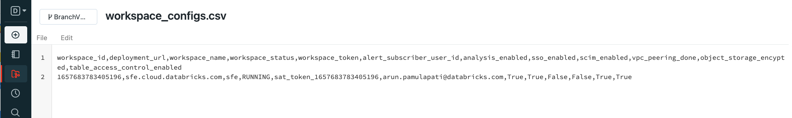

## Checklist to prepare for SAT setup

You will need the following information to set up SAT, we will show you how to gather them in the next section.

 1. Databricks Account ID, administrative user id and password  (To use account REST APIs)
 2. A Single user job cluster (To run the SAT checks)
 3. Databricks SQL Warehouse  (To run the SQL dashboard)
 4. Ensure that Databricks Repos is enabled (To access the SAT git)
 5. Pipy access from your workspace (To install the SAT utility library)


## Prerequisites 
 
 Please gather the following information before you start setting up: 
 
 1. Databricks Account ID 
     * Please test your administrator account and password to make sure this is a working account: [https://accounts.cloud.databricks.com/login](https://accounts.cloud.databricks.com/login)
     * Copy the account id as shown below

        

 2. A Single user cluster  
    *  Databricks Runtime Version  11.2 LTS or above
    *  Node type i3.xlarge

        

 3. Databricks SQL Warehouse  
    * Goto SQL (pane) -> SQL Warehouse -> and pick the SQL Warehouse for your dashboard and note down the ID as shown below

        

 4. Databricks Repos to access SAT git
    Import git repo into Databricks repo 

    ``` 
           https://github.com/databricks-industry-solutions/security-analysis-tool
    ```


      

 5. Please confirm PyPI access is available

    * Open the \<SATProject\>/notebooks/Includes/install_sat_sdk  and run on the cluster that was created in the Step 2 above. 
    Please make sure there are no errors.

## Configuration

  * Download and setup Databricks CLI by following the instructions [here](https://docs.databricks.com/dev-tools/cli/index.html)  
  * Note: if you have multiple Databricks profiles you will need to use --profile <profile name> switch to access the correct workspace,
    follow the instructions [here](https://docs.databricks.com/dev-tools/cli/index.html#connection-profiles) . Throughout the documentation below we use an example profile **e2-certification**, please adjust your commands as per your workspace profile or exclude  --profile <optional-profile-name> if you are using the default profile. 
  * Setup authentication to your Databricks workspace by following the instructions [here](https://docs.databricks.com/dev-tools/cli/index.html#set-up-authentication)

       ```
            databricks configure --token --profile e2-certification
       ```

     

     You should see a listing of folders in your workspace : 
      ```
           databricks --profile e2-certification workspace ls
      ```

     


  *  Set up the secret scope with the scope name you prefer and note it down:

     ```
      databricks --profile e2-certification secrets create-scope --scope sat_master_scope
      ```

     For more details refer [here](https://docs.databricks.com/dev-tools/cli/secrets-cli.html) 

  *  Create username secret and password secret as  "user" and "pass" under the above "sat_master_scope" scope using Databricks Secrets CLI 

      *  Create secret for master account username
        ```
        databricks --profile e2-certification secrets put --scope sat_master_scope --key user
        ```

      *  Create secret for master account password

        ```
        databricks --profile e2-certification secrets put --scope sat_master_scope --key pass
        ```    
        
        Note: The values you place above are case sensitive


   * Open the \<SATProject\>/notebooks/Utils/initialize notebook and modify the JSON string with :  
     * Set the value for the account id 
     * Set the value for the sql_warehouse_id
     * databricks secrets scope/key names to pick the secrets from the steps above.

  * Your config in  \<SATProject\>/notebooks/Utils/initializ CMD 3 should look like this:

     ```
           {
              "account_id":"aaaaaaaa-bbbb-cccc-dddd-eeeeeeeeeeee",  <- update this value
              "verbosity":"info",
              "master_name_scope":"sat_master_scope", <- Make sure this matches the secrets scope
              "sql_warehouse_id":"4d9fef7de2b9995c",     <- update this value
              "dashboard_id":"317f4809-8d9d-4956-a79a-6eee51412217",
              "dashboard_folder":"../../dashboards/",
              "dashboard_tag":"SAT",
              "master_name_key":"user",  
              "master_pwd_scope":"sat_master_scope",  
              "master_pwd_key":"pass",
              "workspace_pat_scope":"sat_master_scope",
              "workspace_pat_token_prefix":"sat_token"
           }
     ```

 
## Setup
 Following are the one time easy steps to get your workspaces setup with the SAT:
                                                          
                                                          
1. List account workspaces to analyze with SAT
   * Goto  \<SATProject\>/notebooks/Setup/1.list_account_workspaces_to_conf_file and Run -> Run all 
   * This creates configuration file as noted at the bottom of the notebook.

    
   
   * Goto  \<SATProject\>/configs/workspace_configs.csv and update the file for each workspace listed as a new line. 
     You will need to set analysis_enabled as True to enroll a workspace to analyzed by the SAT.

     Set alert_subscriber_user_id to a valid user login email address to receive alerts

     Note: no  “+” character in the alert_subscriber_user_id values due to a limitation with the alerts API. 

    
   
   
   
2. Generate secrets setup file
   * Run the \<SATProject\>/notebooks/Setup/2.generate_secrets_setup_file notebook.  Setup your PAT tokens for each of the workspaces under the "master_name_scope” 

    

    We generated a template file: \<SATProject\>/configs/setupsecrets.sh to make this easy for you with 
    [curl](https://docs.databricks.com/dev-tools/api/latest/authentication.html#store-tokens-in-a-netrc-file-and-use-them-in-curl), 
    copy and paste and run the commands from the file with your PAT token values. 
    You will need to [setup .netrc file](https://docs.databricks.com/dev-tools/api/latest/authentication.html#store-tokens-in-a-netrc-file-and-use-them-in-curl) to use this method

   Example:

    curl --netrc --request POST 'https://oregon.cloud.databricks.com/api/2.0/secrets/put' -d '{"scope":"
 sat_master_scope", "key":"sat_token_1657683783405197", "string_value":"<dapi...>"}' 
   
   
3. Test API Connections    
   * Test connections from your workspace to accounts API calls and all workspace API calls by running \<SATProject\>/notebooks/Setup/3. test_connections. It's important that all connections are successful before you can move to the next step.  

    
   
4. Enable workspaces for SAT 
   * Enable workspaces by running \<SATProject\>/notebooks/Setup/4. enable_workspaces_for_sat.  This makes the registered workspaces ready for SAT to monitor 

    
   
5. Import SAT dashboard template
   * We built a ready to go DBSQL dashboard for SAT. Import the dashboard by running \<SATProject\>/notebooks/Setup/5. import_dashboard_template

       
   
6. Configure Alerts  (Optional)
   SAT can deliver alerts via email via Databricks SQL Alerts. Import the alerts template by running \<SATProject\>/notebooks/Setup/6. configure_alerts_template (optional)

   
   

  
   
   
## Usage
1. Attach and run the notebook \<SATProject\>/notebooks/security_analysis_driver 

   
   
   At this point you should see **SAT** database and tables in your SQL Warehouses:

   
   
   
   
2. Access Databricks SQL Dashboards section and find "SAT - Security Analysis Tool" dashboard  to see the report. You can filter dashboard by **SAT** tag. 
   
   

    Note: You need to run the individual queries cached behind the report for the first time. Look for queries in the queries pane tagged with **SAT** and run each one of them by clicking on the query, opening them in the SQL Edition and Run. Once you run all of the queries refresh your dashboard. 

    You can share SAT dashboard with other members of your team by using "Share" functionality on the top right corner of the dashboard. 

   
   
## Configure Workflow (Optional) 
  * Databricks Workflows is the fully-managed orchestration service. You can configure SAT to automate when and how you would like to schedule it by using by taking advantage of Workflows. 

  * Goto Workflows - > click on create jobs -> setup as following:

    Task Name  : security_analysis_drive

    Type: Notebook

    Source: Workspace (or your git clone of SAT)

    Path : \<SATProject\>/SAT/SecurityAnalysisTool-BranchV2Root/notebooks/security_analysis_driver

    Cluster: Make sure to pick the Single user mode job compute cluster you created. 

       

    Add schedule as per your needs. That’s it. Now you are continuously monitoring the health of your account workspaces.

## Activate Alerts (Optional) 
  * Goto Alerts and find the alert created by SAT tag and unmute it and run the query behind the alert to activate it. Set the alert schedule to your needs. 


         

         

   
## Troubleshooting
   
1. Incorrectly configured secrets
    * Error:
   
      Secret does not exist with scope: sat_master_scope and key: sat_tokens

    * Resolution:
      Check if the tokens are configured with correct names by listing and comparing with the configuration.
      databricks secrets list --scope sat_master_scope

2. Invalid access token
   
    * Error:
   
      Error 403 Invalid access token.

    * Resolution: 
   
      Check your PAT token configuration for  “workspace_pat_token” key 

3. Firewall blocking databricks accounts console

    * Error: 
         <p/>   
         Traceback (most recent call last): File "/databricks/python/lib/python3.8/site-packages/urllib3/connectionpool.py", line 670, in urlopen  httplib_response = self._make_request(  File "/databricks/python/lib/python3.8/site-packages/urllib3/connectionpool.py", line 381, in _make_request  self._validate_conn(conn)  File "/databricks/python/lib/python3.8/site-packages/urllib3/connectionpool.py", line 978, in _validate_conn  conn.connect()  File "/databricks/python/lib/python3.8/site-packages/urllib3/connection.py", line 362, in connect  self.sock = ssl_wrap_socket(  File "/databricks/python/lib/python3.8/site-packages/urllib3/util/ssl_.py", line 386, in ssl_wrap_socket  return context.wrap_socket(sock, server_hostname=server_hostname)  File "/usr/lib/python3.8/ssl.py", line 500, in wrap_socket  return self.sslsocket_class._create(  File "/usr/lib/python3.8/ssl.py", line 1040, in _create  self.do_handshake()  File "/usr/lib/python3.8/ssl.py", line 1309, in do_handshake  self._sslobj.do_handshake() ConnectionResetError: [Errno 104] Connection reset by peer During handling of the above exception, another exception occurred:

    * Resolution: 
   
      Run this following command in your notebook %sh 
      curl -X GET -H "Authorization: Basic <base64 of userid:password>" -H "Content-Type: application/json" https://accounts.cloud.databricks.com/api/2.0/accounts/<account_id>/workspaces

      If you don’t see a JSON with a clean listing of workspaces you are likely having a firewall issue that is blocking calls to the accounts console.  Please have your infrastructure team add Databricks accounts.cloud.databricks.com to the allow-list.   


                                                          
