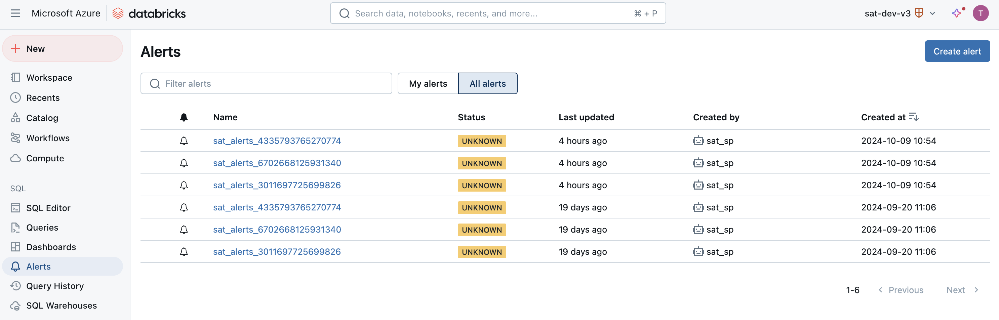
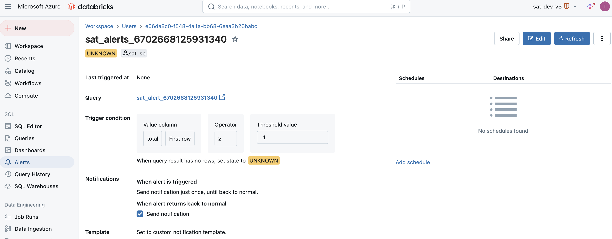
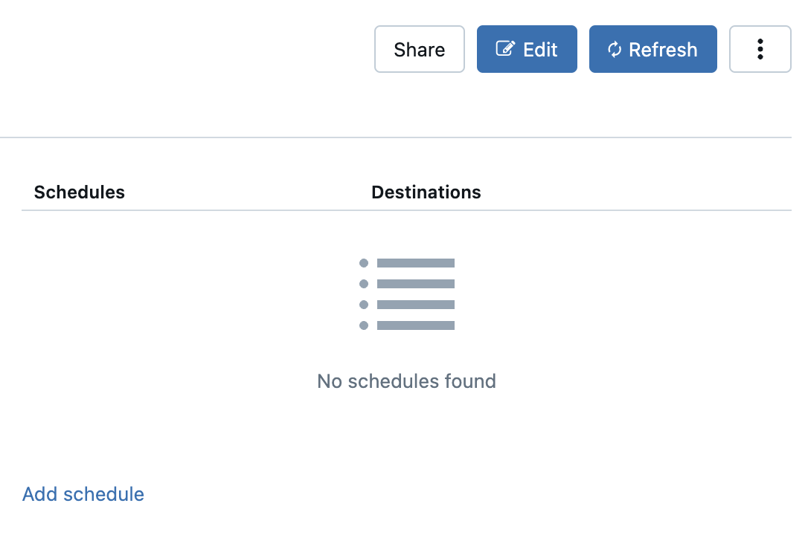
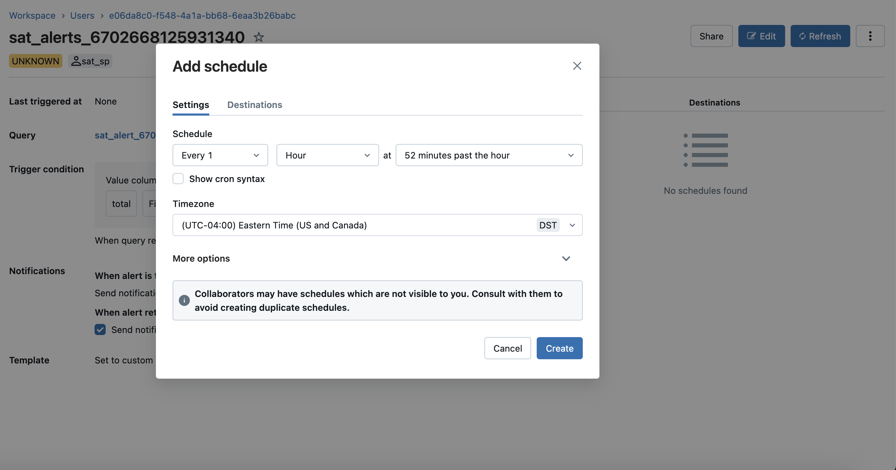
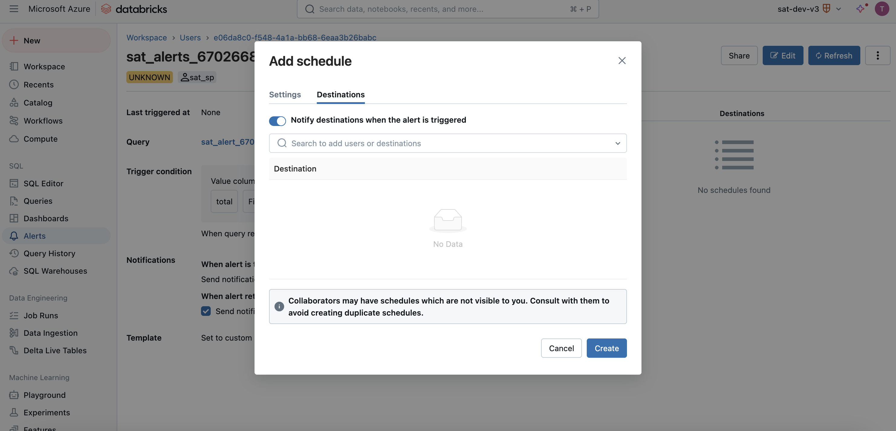
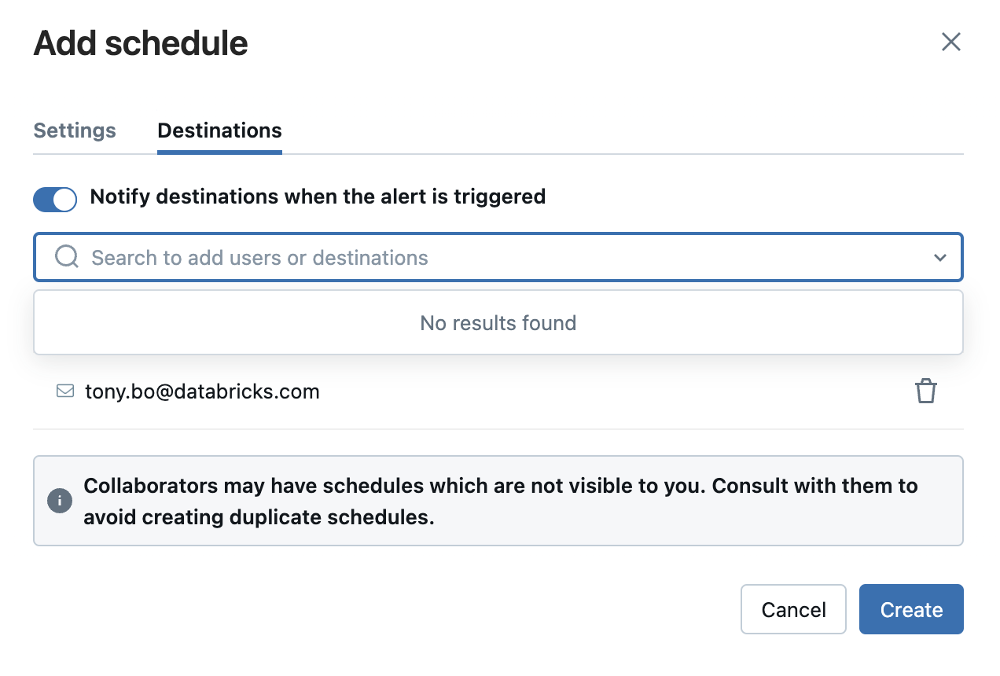

# Setup Guide

> **SAT v0.2.0 or higher** brings full support for Unity Catalog. Now you can pick your catalog instead of hive_metastore. Plus, you get to choose your own schema name.

> **Note**: SAT requires at least one SAT set up in a workspace per **account** in AWS or GCP and at least one SAT set up in a workspace per Azure **subscription**.  

>  Please make sure to review the SAT report with your business stakeholders, administrators, security team and auditors about SAT report and assess your organizational security requirements before making any security improvements bases on the report, not all deviations required to be mitigated. Some of the recommendations may have cost implications, some of the security features recommended may have dependency feature limitations, please thoroughly review individual feature documentation before making changes to your security configurations.

Follow this guide to setup the Security Analysis Tool (SAT) on your Databricks workspace.

## Prerequisites

Before proceeding with the installation, make sure you have the following prerequisites:

- Python 3.9 or higher
- Databricks CLI installed with a profile logged (See [here](https://docs.databricks.com/en/dev-tools/cli/install.html).)
- Databricks Account ID
- Databricks SQL Warehouse (To run the SQL dashboard)
- Pypi access from your workspace (To install the SAT utility library)
  
> SAT is beneficial to customers on **Databrics Premium or Enterprise** as most of the checks and recommendations involve security features available in tiers higher than the Standard.

### Considerations

SAT creates a new security_analysis database and Delta tables. If you are an existing SAT user please run the following command:

### Hive metastore based schema

```sql
  drop  database security_analysis cascade;
```

### Unity Catalog based schema

```sql
  drop  database <uc_catalog_name>.<schema_name> cascade;
```

## Setup

> SAT is a productivity tool to help verify security configurations of Databricks deployments, it's not meant to be used as certification or attestation of your deployments. SAT project is regularly updated to improve the correctness of checks, add new checks, and fix bugs. You will need a single SAT install per Databricks account in AWS and GCP and a single install per azure subscription in Azure. Add the Service principle as mentioned in the detailed steps to analyze the rest of the workspaces from the workspace where SAT is installed. You can choose not to add SP to a given workspace if you wish to ignore a given workspace.
> Please send your feedback and comments to sat@databricks.com. 

SAT can be setup on any of the cloud providers where Databricks is hosted. Follow the setup guide for the cloud provider you are using:

- [AWS Setup Guide](./setup/aws.md)
- [Azure Setup Guide](./setup/azure.md)
- [GCP Setup Guide](./setup/gcp.md)

**Note**: SAT can be setup as Terraform based deployment, if you use Terraform in your organization please prefer Terraform instructions: 

* [SAT AWS Terraform deployment](https://github.com/databricks-industry-solutions/security-analysis-tool/blob/main/terraform/aws/TERRAFORM_AWS.md) 
* [SAT Azure Terraform deployment](https://github.com/databricks-industry-solutions/security-analysis-tool/blob/main/terraform/azure/TERRAFORM_Azure.md) 
* [SAT GCP Terraform deployment](https://github.com/databricks-industry-solutions/security-analysis-tool/blob/main/terraform/gcp/TERRAFORM_GCP.md)

## FAQs and Troubleshooting

[Find answers to frequently asked questions, troubleshoot SAT issues, or diagnose SAT setup](./setup/faqs_and_troubleshooting.md)


## Usage
 

 > **Note**:  Go to Workspace -> Applications -> SAT -> files -> self_assessment_checks.yaml and make sure the "enabled" values reflect your environment for the listed manual checks with either true or false. SAT will automatically check the rest of the configurations.


### 1. Run jobs

 > **Note**: This process takes up to 10 mins per workspace
 
You now have two jobs (SAT Initializer Notebook & SAT Driver Notebook). Run SAT Initializer Notebook and when it completes run SAT Driver Notebook; SAT Initializer Notebook should only be run once (although you can run it multiple times, it only needs to be run successfully one time), and SAT Driver Notebook can be run periodically (it's scheduled to run once every Monday, Wednesday, and Friday)

   At this point you should see **SAT** database and tables in your SQL Warehouses:

   


###  2. Access Databricks SQL Dashboards

   > **Note:** You can use Lakeview Dashboards to view the results.
 
The Dashboard is, by default, owned by the profile you used to set up SAT or the Service Principle. If you see errors running the dashboard, you are likely running into permissions issues. 
 1. Go over to the dashboard and click on the "Share" button in the top right.
 2. Click on the cogwheel and select the option "Assign new owner"
 3. Assign yourself as the new owner of the dashboard. You can also assign this to someone who has access to the SAT catalog/schema and tables.
 4. Click on the "Published" option at the top to switch to the draft version of the dashboard.Click on the "Publish" button next to the share option.
 5. In the general settings section, you can choose one of two options: 
      Embed credentials (default): All viewers will run queries using the owner's credentials and compute. This may expose data to users who normally wouldn't have access.
      Don't ember credentials: Each viewer will need access to this workspace, the associated data, and the compute to view this dashboard. We recommend using this option.


  > **Note:** We are switching SAT to Lakeview Dashboard, but the classic dashboard is still available.
In DBSQL find "SAT - Security Analysis Tool" dashboard  to see the report. You can filter the dashboard by **SAT** tag.  (The old classic legacy dashboard can be found in Workspace -> Home -> SAT_dashboard)

   

   > **Note:** You need to select the workspace and date and click "Apply Changes" to get the report.

   > **Note:** The dashbord shows last valid run for the selected date if there is one, if not it shows the latest report for that workspace.  
 
You can share SAT dashboard with other members of your team by using the "Share" functionality on the top right corner of the dashboard. 

Here is what your SAT Dashboard should look like:
 
      
    
### 3. Activate Alerts 

On the left side bar, navigate to ```SQL > Alerts```. By default, the ```My Alerts``` tab will be selected, but you can click on the ```All alerts``` tab to see the alerts created by SAT. Once you have clicked the ```All alerts``` tab, you will see the SAT alerts, similar to the image below:


<br/>

##### Notification Delivery

Click on an alert to see the details:

  
<br/>

In the expanded alert details, click ```Add schedule``` (located at the bottom left of this screenshot):

  
<br/>

In the ```Settings``` tab, you can define the interval for the alert to be triggered:


<br/>

Next, click the ```Destinations``` tab: 


<br/>

In the search bar, you can search for a user (email) or destination object. In the screenshot below, we selected email as our destination for our alert: 


<br/>

Click create to save the schedule with defined destinations configured: 


<br/>

You can add more recipients to alerts, check out the [notification destinations](https://docs.databricks.com/sql/admin/notification-destinations.html) documenation.
     

### 4. Update  configuration files (Optional)

#### 1. Modify security_best_practices (Optional) 

- Go to Workspace -> Applications -> SAT  -> files -> notebooks /Setup/7. update_sat_check_configuration and use this utility to enable/disable a Check, modify Evaluation Value and Alert configuration value for each check. You can update this file any time and any analysis from there on will take these values into consideration. 

- [Configure widget settings](https://docs.databricks.com/notebooks/widgets.html#configure-widget-settings-1) behavior "On Widget Change" for this notebooks to "Do Nothing"         
            
    
 
#### 2. Modify workspace_configs file (Required for manual checks values)

- **Tip**:  You can use this utility to turn on a specific workspace and turn off other workspaces for a specific run.

- **Tip**:  You can use this utility to apply your edits to multiple workspaces settings by using "Apply Setting to all workspaces" option.

- Go to Workspace -> Applications -> SAT  -> files -> notebooks/Setup/8. update_workspace_configuration and  You will need to set analysis_enabled as True or False based on if you would like to enroll a workspace to analyze by the SAT.

- [Configure widget settings](https://docs.databricks.com/notebooks/widgets.html#configure-widget-settings-1) behavior "On Widget Change" for this notebooks to "Do Nothing"   

Update values for each workspace for the manual checks

- sso_enabled : True if you enabled Single Singn-on for the workspace
- scim_enabled: True if you integrated with  SCIM for the workspace
- vpc_peering_done: False if you have not peered with another VPC 
- object_storage_encypted: True if you encrypted your data buckets
- table_access_control_enabled : True if you enabled ACLs so that you can utilize Table ACL clusters that enforce user isolation  

  


## Uninstall SAT

### Standard Setup

Steps:
- Delete `/Workspaces/SAT` folder
- Delete Workflows `SAT Initializer Notebook` and `SAT Driver Notebook`
- Delete the Dashboards

### Terraform

Uninstalling using `terraform destroy`
