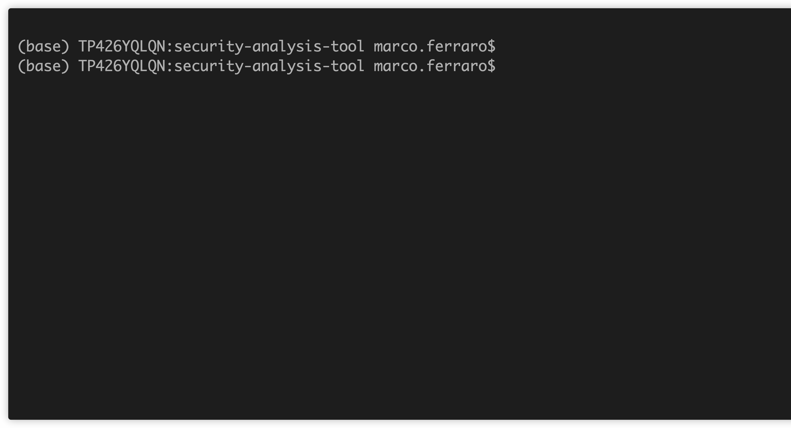

# AWS Setup Guide

This guide will help you setup the Security Analysis Tool (SAT) on AWS Databricks.

- [AWS Setup Guide](#aws-setup-guide)
  - [Prerequisites](#prerequisites)
    - [Service Principal](#service-principal)
  - [Installation](#installation)
    - [Credentials Needed](#credentials-needed)
  - [Troubleshooting](#troubleshooting)

## Prerequisites

There are some prerequisites that need to be met before you can set up SAT on AWS. Make sure you have the appropriate permissions in your Databricks Account Console to create the resources mentioned below.

> SAT is beneficial to customers on **Databricks Premium or Enterprise** as most of the checks and recommendations involve security features available in tiers higher than the Standard.

### Service Principal

The first step is to create a Service Principal in Databricks. This will allow SAT to authenticate with the other workspaces. Follow the steps:

- Go to the [Account Console](https://accounts.cloud.databricks.com)
- On the left side bar menu, click on `User management`
- Select `Service Principal` and then `Add service principal`
- Type a new name for the service principal.
- The Service Principal must be granted the `Account Admin` role. This role provides the ability to manage account-level settings and permissions.
- Assign the Workspace Admin Role: The Service Principal must be assigned the `Workspace Admin` role for each workspace it will manage. This role provides the ability to manage workspace-level settings and permissions.
- Add to the Metastore Admin Group: The Service Principal must be added to the `Metastore Admin` group or role. This role provides the ability to manage metastore-level settings and permissions.
- Create a new OAuth Secret.
- Save the `Secret` and `Client ID`
- To deploy SAT in a workspace, you must add the Service Principal to the workspace.
  


> The Service Principle requires an [Accounts Admin role](https://docs.gcp.databricks.com/en/admin/users-groups/service-principals.html#assign-account-admin-roles-to-a-service-principal), [Admin role](https://docs.gcp.databricks.com/en/admin/users-groups/service-principals.html#assign-a-service-principal-to-a-workspace-using-the-account-console) for **each workspace** and needs to be a member of the [metastore admin group](https://docs.gcp.databricks.com/en/data-governance/unity-catalog/manage-privileges/admin-privileges.html#who-has-metastore-admin-privileges) is required to analyze many of the APIs

## Installation

### Credentials Needed

To setup SAT on AWS, you will need the following credentials:
- Databricks Account ID
- Databricks Service Principal ID
- Databricks Service Principal Secret

To execute the SAT follow these steps on your workstation or a compatible VM that has access to the internet and the Databricks workspace:

- Clone the SAT repository locally
  
  ```sh
    git clone https://github.com/databricks-industry-solutions/security-analysis-tool.git
   ```

> Remember that the target workspace should have a [profile](https://docs.gcp.databricks.com/en/dev-tools/cli/profiles.html) in [Databricks CLI](https://docs.gcp.databricks.com/en/dev-tools/cli/tutorial.html)

- Run the `install.sh` script on your terminal.

> To ensure that the install.sh script is executable, you need to modify its permissions using the chmod command.
    ```sh
      chmod +x install.sh
      ./install.sh
    ```

> **Proxies are now supported as part of SAT. You can add your HTTP and HTTPS links to use your proxies.**



Congratulations! 🎉 You are now ready to start using the SAT. Please click [here](../setup.md#usage) for a detailed description on how to run and use it.

## Troubleshooting

Please review the FAQs and Troubleshooting resources documented [here](./faqs_and_troubleshooting.md) including a notebook to help diagnose your SAT setup.
If any issues arise during the installation process, please check your credentials and ensure that you have the appropriate configurations and permissions for your Databricks. If you are still facing issues, please send your feedback and comments to <sat@databricks.com>.
