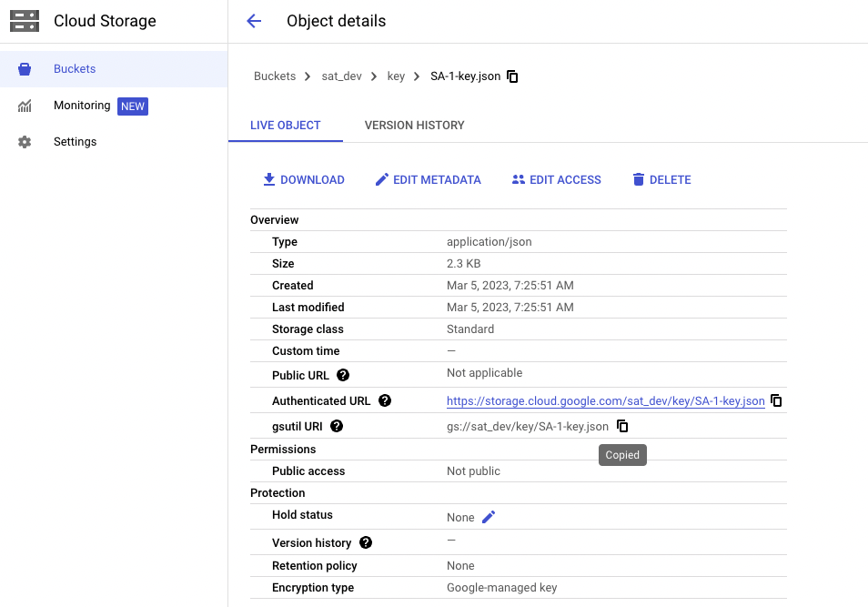

# GCP Setup Guide

This guide will help you setup the Security Analysis Tool (SAT) on GCP Databricks.

- [GCP Setup Guide](#gcp-setup-guide)
  - [Prerequisites](#prerequisites)
    - [Service Accounts](#service-accounts)
    - [Databricks Service Principal](#databricks-service-principal)
  - [Installation](#installation)
    - [Credentials Needed](#credentials-needed)
  - [Troubleshooting](#troubleshooting)

## Prerequisites

There are some pre-requisites that need to be met before you can setup SAT on GCP. Make sure you have the appropriate permissions in your GCP Cloud account to create the resources mentioned below.

> SAT is beneficial to customers on **Databrics Premium or Enterprise** as most of the checks and recommendations involve security features available in tiers higher than the Standard.

### Service Accounts

The first step is to create a Service Principal in GCP. This will allow SAT to authenticate with GCP services. Follow the steps below to create a Service Principal:

- Please follow [this](https://docs.gcp.databricks.com/en/dev-tools/authentication-google-id.html) guide to create the required service accounts.
- Now upload the SA-1.json file into a GCS bucket.
- To add the service account to the Account Console:
  - You will need to create a new user and add the service account email as the user email.
- The Service Principal must be granted the `Account Admin` role. This role provides the ability to manage account-level settings and permissions.
- Assign the Workspace Admin Role: The Service Principal must be assigned the `Workspace Admin` role for each workspace it will manage. This role provides the ability to manage workspace-level settings and permissions.
- Add to the Metastore Admin Group: The Service Principal must be added to the `Metastore Admin` group or role. This role provides the ability to manage metastore-level settings and permissions.

### Databricks Service Principal

The first step is to create a Service Principal in Databricks. This will allow SAT to authenticate with the other workspaces. Follow the steps:

- Go to the [Account Console](https://accounts.cloud.databricks.com)
- On the left side bar menu, click on `User management`
- Select `Service Principal` and then `Add service principal`
- Type a new name for the service principal.
- The Service Principal must be granted the `Account Admin` role. This role provides the ability to manage account-level settings and permissions.
- Assign the Workspace Admin Role: The Service Principal must be assigned the `Workspace Admin` role for each workspace it will manage. This role provides the ability to manage workspace-level settings and permissions.
- Add to the Metastore Admin Group: The Service Principal must be added to the `Metastore Admin` group or role. This role provides the ability to manage metastore-level settings and permissions.
- Create a new OAuth Secret.
- Save the `Secret` and `Client ID`
- To deploy SAT in a workspace, you must add the Service Principal to the workspace.

## Installation

### Credentials Needed

To setup SAT on GCP, you will need the following credentials:

- Databricks Account ID
- Service Account email
- gsutil URI from GCS Bucket
- 

To execute the SAT follow these steps on your workstation or a compatible VM that has access to the internet and the Databricks workspace:

- Clone the SAT repository locally
  
  ```sh
    git clone https://github.com/databricks-industry-solutions/security-analysis-tool.git
   ```

> To ensure that the install.sh script is executable, you need to modify its permissions using the chmod command.

> For linux or mac users:
> ```sh
> chmod +x install.sh
>```

> Remember that the target workspace should have a [profile](https://docs.gcp.databricks.com/en/dev-tools/cli/profiles.html) in [Databricks CLI](https://docs.gcp.databricks.com/en/dev-tools/cli/tutorial.html)

- Run the `install.sh` script on your terminal.


Congratulations! 🎉 You are now ready to start using SAT. Please click [here](../setup.md#usage) for a detailed description on how to run and use it.


## Troubleshooting
Please review the FAQs and Troubleshooting resources documented [here](./faqs_and_troubleshooting.md) including a notebook to help diagnose your SAT setup.
If any issues arise during the installation process, please check your credentials and ensure that you have the appropriate permissions in your GCP cloud account. If you are still facing issues, please send your feedback and comments to <sat@databricks.com>.
